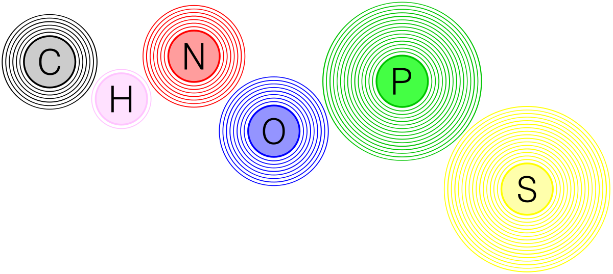

# Mod_5_Final_Project
## Predicting the Toxicity of Chemical Compounds on the Androgen Receptor: A Key Therapeutic Target for Prostate Cancer

### Data Sourcing Content

The 2014 Tox21 data challenge was designed to help scientists understand the potential of the chemicals and compounds being tested through the Toxicology in the 21st Century initiative to disrupt biological pathways in ways that may result in toxic effects. The goal of the challenge was to "crowdsource" data analysis by independent researchers to reveal how well they can predict compounds' interference in biochemical pathways using only chemical structure data. The computational models produced from the Challenge could become decision-making tools for government agencies in determining which environmental chemicals and drugs are of the greatest potential concern to human health. 

Futheremore, the Tox21 dataset comprises of 7831 molecule, represented by the simplified molecular-input line-entry system (SMILES) which is a specification in the form of a line notation for describing the structure of chemical entity, and for each molecule there are 12 binary labels that represent the outcome (active/inactive) of 12 different toxicological experiments. However, for this specific project my focus will solely be on the toxicity of the molecules on the Androgen Receptor (AR). The AR, a nuclear hormone receptor, plays a critical role in AR-dependent prostate cancer and other androgen related diseases. Thus, AR is an important therapeutic target for those who are afflicted with prostate cancer.

Note that the label matrix contains many missing values (NaNs). The original data source and Tox21 challenge site is https://tripod.nih.gov/tox21/challenge/.

### Business Case

"Prostate cancer is the most common cancer and the second leading cause of cancer death among men in the United States. Prostate cancer usually grows very slowly, and finding and treating it before symptoms occur may not improve men's health or help them live longer." - (https://www.cancer.gov/types/prostate). 

Cancer starts when cells in the body begin to grow out of control. Cells in nearly any part of the body can become cancer cells, and can then spread to other areas of the body. Prostate cancer begins when cells in the prostate gland start to grow out of control. The prostate is a gland found only in males. It makes some of the fluid that is part of semen.

The prostate is below the bladder (the hollow organ where urine is stored) and in front of the rectum (the last part of the intestines). Just behind the prostate are glands called seminal vesicles that make most of the fluid for semen. The urethra, which is the tube that carries urine and semen out of the body through the penis, goes through the center of the prostate. The size of the prostate can change as a man ages. In younger men, it is about the size of a walnut, but it can be much larger in older men.

With that context given, my goal with this project is two fold. First and foremost, to partner with pharmaceutical/biotechnology companies to aid in their ability to predict whether or not chemical compounds are toxic or not to the Androgen Receptor. Secondly, to generate a repository of de novo molecules that can potentially serve as therapeutics to those afflicted with Prostate Cancer. 

In order to achieve such a goal I must first create a series of machine learning models that are capable of prediciting classifying whether or not chemical compounds are or not toxic to the Androgen Receptor from the aforementioned dataset, and eventually newly included chemical compounds as well. 

### Data Cleaning

Thankfully, this dataset was fairly clean however upon downloading the dataset it was immediately apparent that there is a significant imbalance within the toxic versus not toxic chemical compounds for the Androgen Receptor: 309 toxic to 6956 not toxic. 

### Data Engineering

Luckily, utilizing the rdkit library I was able to add Hydrogen atoms, as Hydrogens in SMILES are usualy ignored, to the MOL column that construct a molecule from a SMILES string. Furthermore, I was able to extract the following for each chemical compound from solely the SMILES string: topological polar surface area, molecular weight, number of valence electrons (electrons in the outer shell), number of atoms in the ring of a cyclic compound other than a carbon atom, general nubmer of all atoms, nubmer of all atoms with molecular weight > 1, number of aromatic (benzene) rings, and number aliphatic (non-benzene) rings. Lastly, I was able to extract the number of the following typical organic atoms: Carbon, Oxygen, Nitrogen, Phosphorus, and Sulfur.

### Dealing With Class Imbalance

To address the class imbalance I tried two techniques; upsampling and Synthetic Minority Oversampling Technique (SMOTE). The SMOTE technique increased both the accuracy and F1 score when compared to their respective baseline models.

https://www.datasciencecentral.com/profiles/blogs/handling-imbalanced-data-sets-in-supervised-learning-using-family

### Models

The following models were created to predict and properly classify this binary problem of Toxic versus Not Toxic: Logistic Regression, K-Nearest Neighbors, Decision Tree, Random Forest, XGBoost, ADABoost, and a Voting Classifier including all the aforementioned models. 

### Conclusion

Saving lives from prostate cancer is an important endeavor. Thus, providing a tool that can accurately detect chemical compound toxicity, for specific biological targets, is crucial in the assessment of currenly known compounds but also for future compounds that have yet been created.

*More to come...*

### Future Work

* Partner with pharmaceutical and biotechnology organizations, clinical research organizations, and academic/research professionals that gather more information regarding toxicity of other chemical compounds on the Androgen Receptor.
* Expand models to predict toxicity of chemical compounds on other biological targets, not just the Androgen Receptor.
* Utilize GPU's/Cloud computing to analyze results quicker and more efficiently.

*More to come...*
